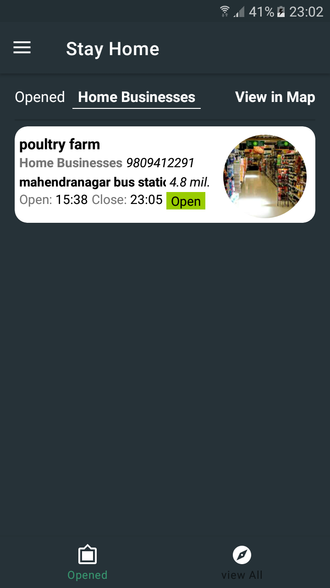
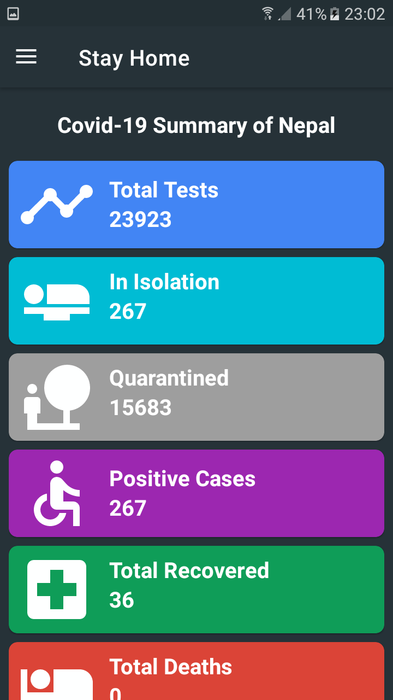
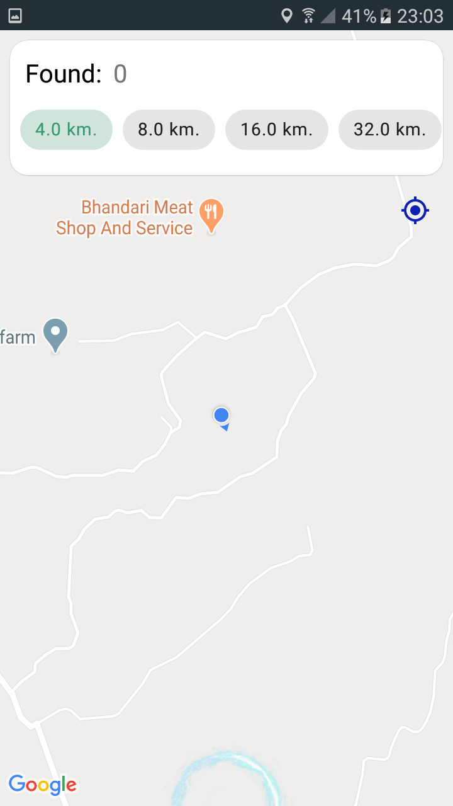
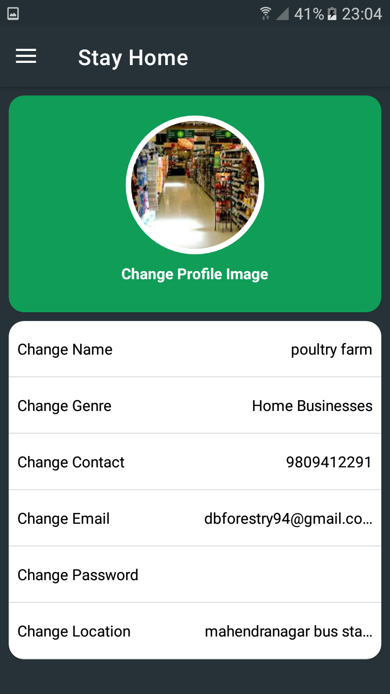

# Stay-Home

This is my personal project for identifying nearby opened places like shops, banks, petrol pumps, hospitals, etc. 

Especially during lockdown time, most of the workspaces like banks, shops, offices, petrol pumps, etc. opens for certain hours in a day. And most of the people might not know about their working hours. 
Stay Home is an app where users can create their workspace like  and let other people know about their opening and closing working hours. It also comes with updates of COVID-19 in Nepal and it helps people to know about the number of COVID-19 patients nearby their location. This makes the app more useful for general people at this time.

It makes use of following tools.
- Firebase Firestore
- Firebase Auth
- Google places API

Few implemented ideas are
- Recyclerview
- Fragments
- Glide
- Navigation Drawer and bottom navigation
- Google Map Fragment

    
